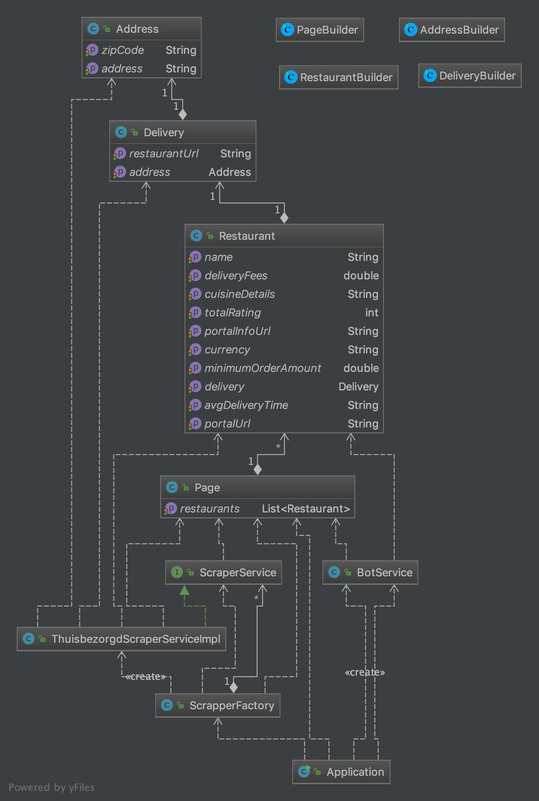
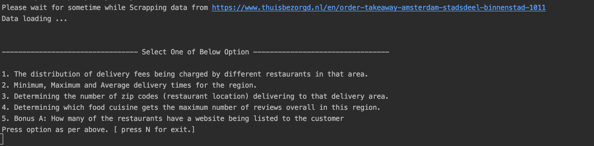

##### Technology detail

- Intellij
- Java 8
- Gradle
- Dependencies : Lombok , Jsoup, httpclient
- Make sure Annotation processing enable in Intelij.

##### Command to create runnable jar and run jar

````
./gradlew clean build jar

java -jar build/libs/scraper-1.0-SNAPSHOT.jar 

````

##### Class Diagram
 

##### After running jar console base bot will open

 